## Performance Metrics Before Sorting Operations

### Sorting

- **Commit Duration:** 5.3 seconds
- **Render Duration:** 102.4 milliseconds
  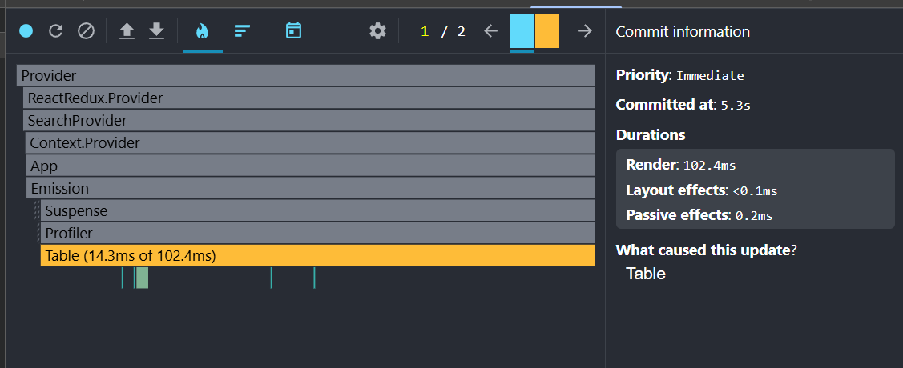
  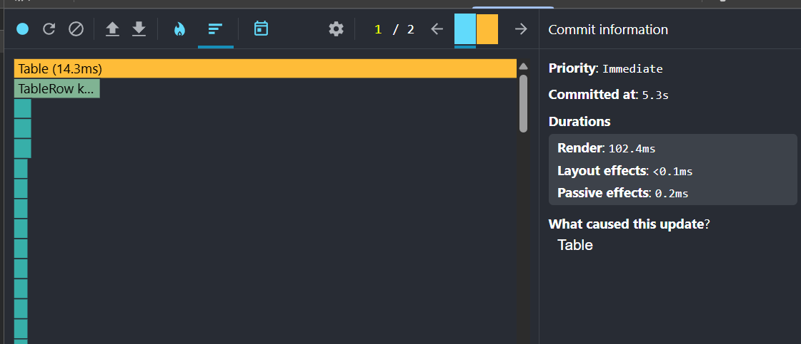

### Filter

- **Commit Duration:** 16.8 seconds
- **Render Duration:** 126.1 milliseconds
  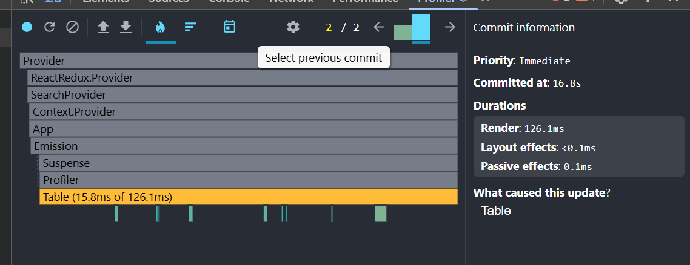
  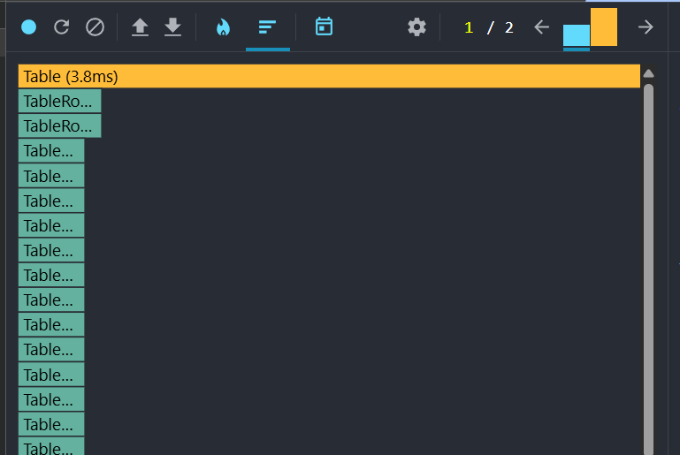

### Search

- **Commit Duration:** 2.9 seconds
- **Render Duration:** 2.3 milliseconds
  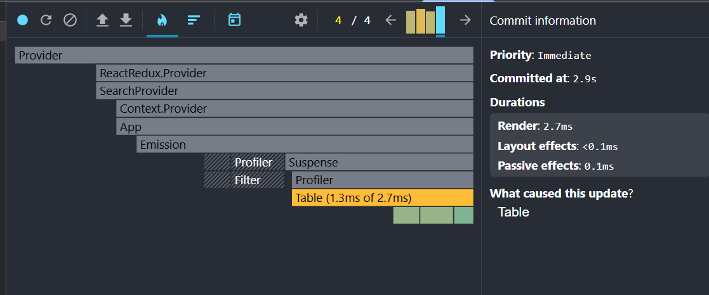
  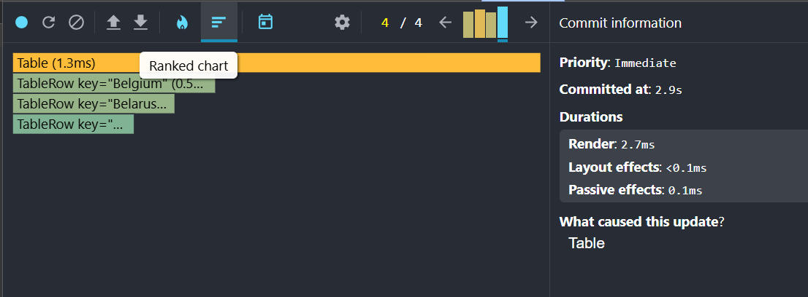

## Performance Metrics After Sorting Operations

### Sorting

- **Commit Duration:** 1.6 seconds
- **Render Duration:** 15.3 milliseconds
  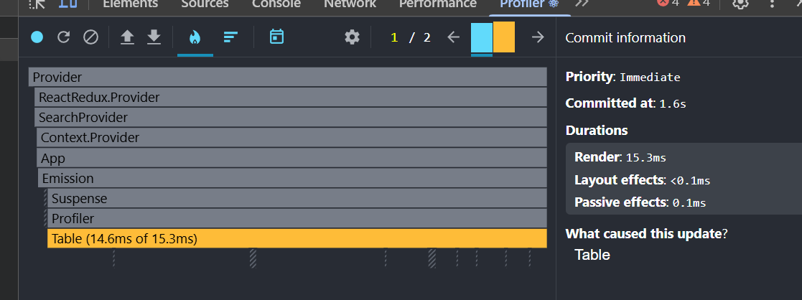
  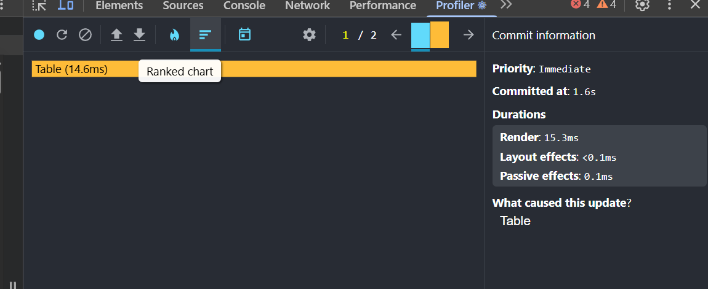

### Filter

- **Commit Duration:** 5.6 seconds
- **Render Duration:** 122 milliseconds
  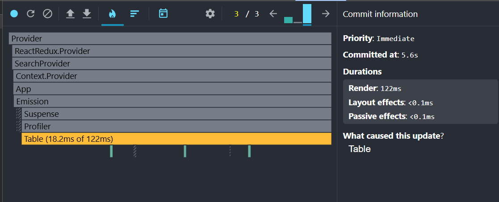
  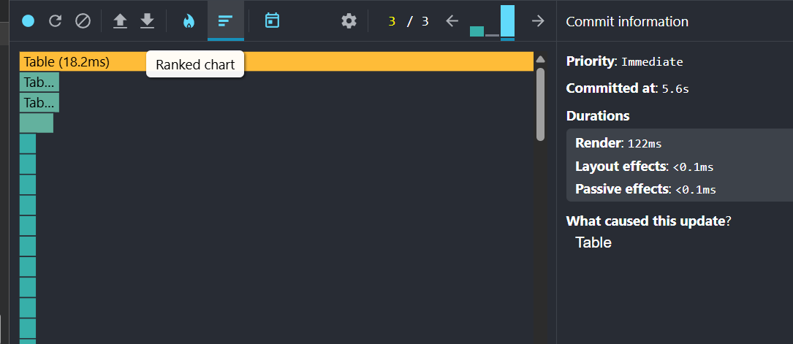

### Search

- **Commit Duration:** 3.4 seconds
- **Render Duration:** 1.5 milliseconds
  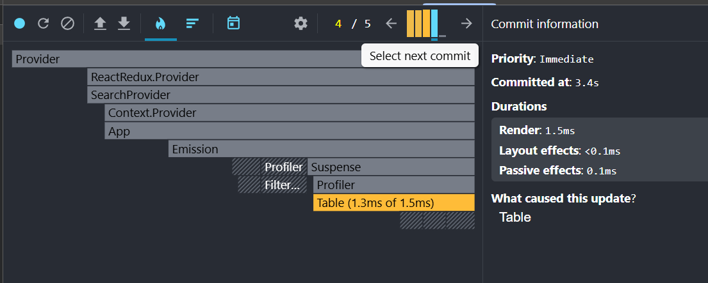
  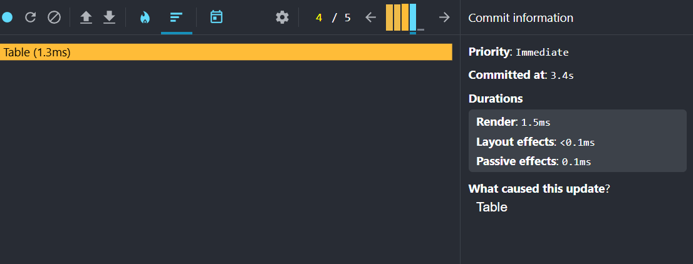
